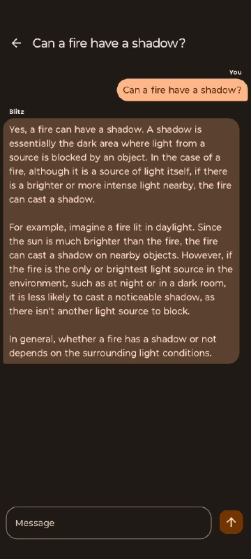
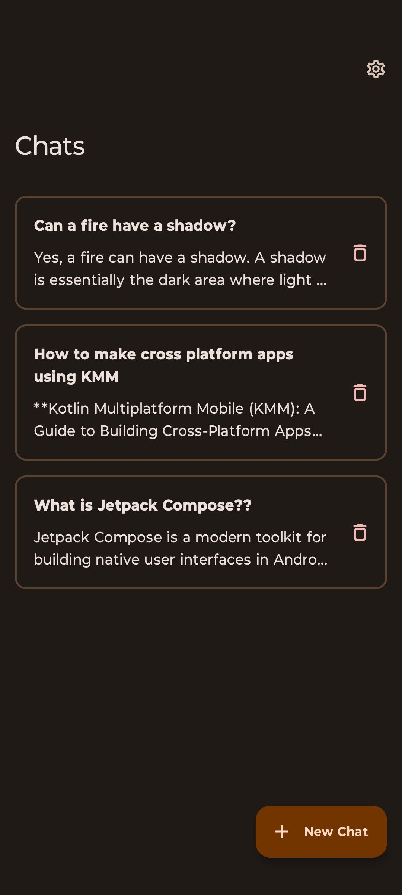
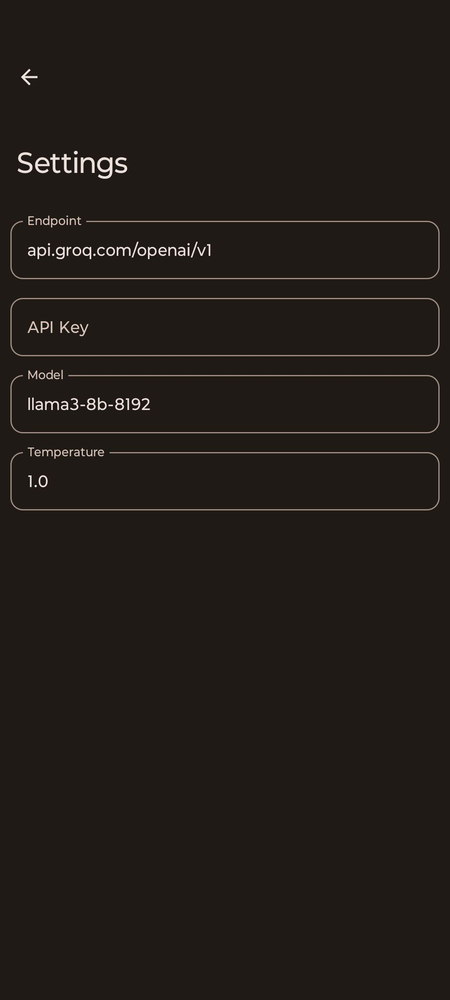

# Blitz AI

Blitz AI is an android application built with jetpack Compose which utilizes [Groq Cloud](https://console.groq.com/docs/quickstart) to generate responses

## Screenshots

  
  
  

## Why Blitz AI?

- **Ridiculously Fast**: Responses happen in real time—no more long waits for answers.
- **Super Accurate**: Delivers better results than competitors, so you're not left second-guessing.
- **Groq Cloud Power**: Blitz AI is backed by the speed and efficiency of Groq Cloud, meaning it’s optimized for performance.

## Download

## Discussions 

## Supported Models

Here are the models Blitz AI supports, along with their developer names and unique IDs for easy pasting in the app's Settings

| Model               | Developer         | ID                          |
|---------------------|-------------------|-----------------------------|
| **Mixtral 8x7B**    | Mistral           | `mixtral-8x7b-32768`        |
| **Llama 3 8B**      | Meta              | `llama3-8b-8192`            |
| **Llama 3 70B**     | Meta              | `llama3-70b-8192`           |
| **Llama Guard 3 8B**| Meta              | `llama-guard-3-8b`          |
| **Llama 3.1 8B (Preview)** | Meta     | `llama-3.1-8b-instant`      |
| **Llama 3.1 70B (Preview)** | Meta   | `llama-3.1-70b-versatile`   |
| **Gemma 7B**        | Google            | `gemma-7b-it`               |
| **Gemma 2 9B**      | Google            | `gemma2-9b-it`              |

A detailed list of all the models are provided [here](https://console.groq.com/docs/models)

 

## Comparison between models

### Speed

 

### Quality
 

### Price

 

